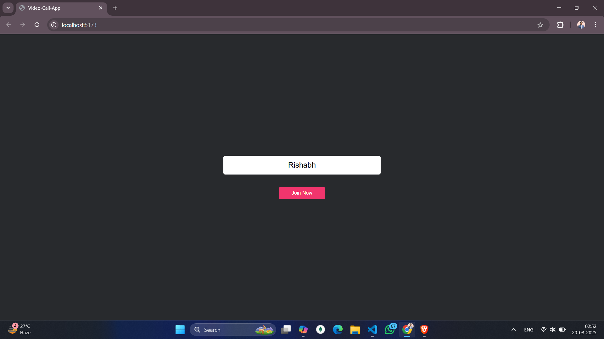
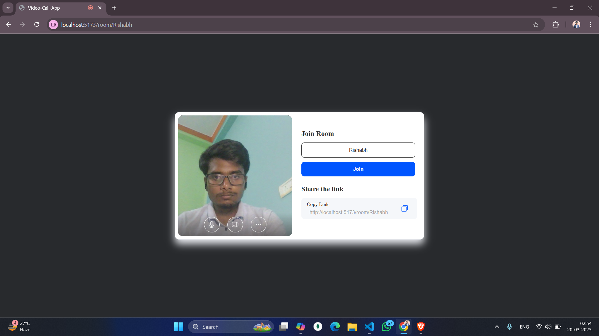
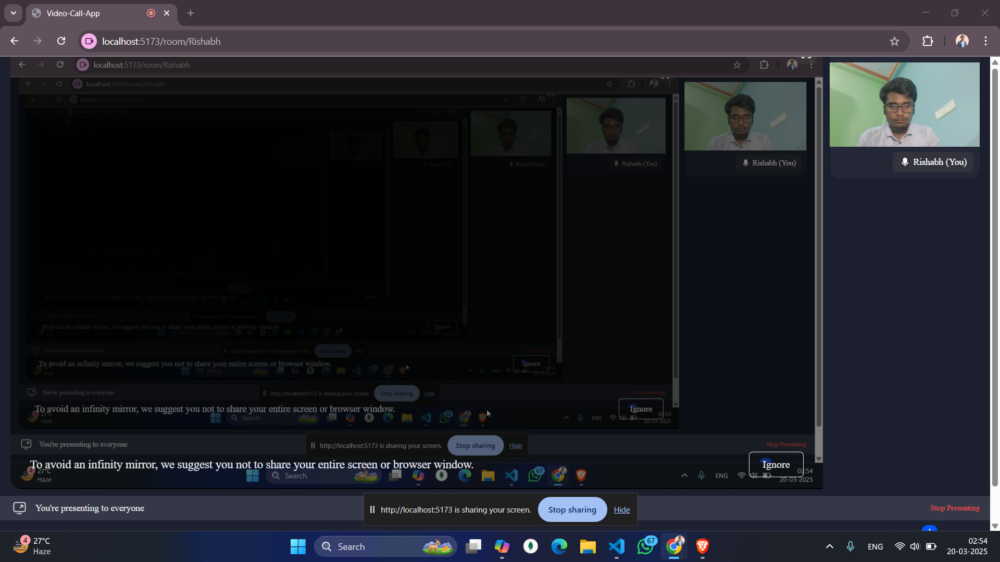
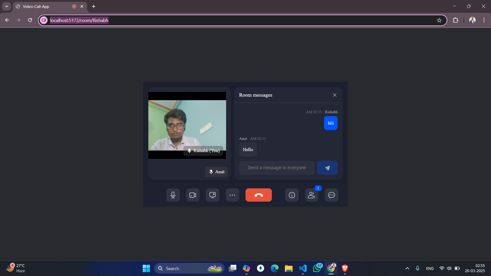

# Video Call App

This is a **React-based video calling application** that leverages the [ZegoCloud API](https://www.zegocloud.com/) to provide real-time video call functionality. Users can join video rooms using unique room IDs and enjoy seamless communication.

# Preview

## Features

- **Real-time video calling** powered by ZegoCloud's UIKit Prebuilt SDK.
- Join video rooms via dynamic Room IDs.
- Lightweight and optimized with modern tools like Vite.
- User-friendly interface with responsive design.

## Tech Stack

- **Frontend**: React, React Router DOM
- **Backend/Real-time Video Call**: ZegoUIKitPrebuilt SDK
- **Build Tool**: Vite
- **Linting**: ESLint
